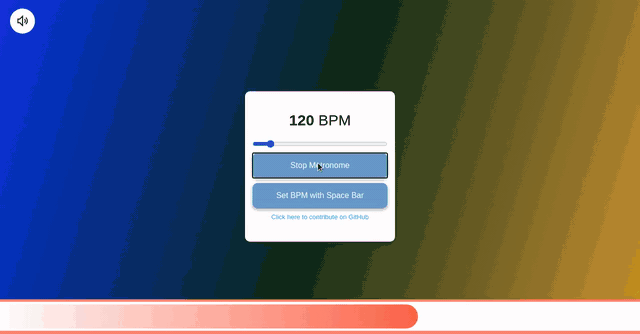

# Visual Metronome

 
After struggling to use Metronomes as I am unable to hear if I land exactly on the beat, I decided to create a visual metronome. This is helpful as you can visualise when the beat changes.

Metronome is available by [Clicking Here](https://netstorm84.github.io/Metronome/)

## Contributing

Feel free to contribute. Create a Pull Request.

- When contributing to this repository, please first discuss the change you wish to make via issue, email, or any other method with the owners of this repository before making a change.
- If there is an issue that exists already with a requested feature, feel free to help yourself and submit a PR.

## Current Features

 - Background changes colour on the beat
 - Set BPM using the space bar
 - Adjust BPM by adjusting the slider
 - Progress bar shows current position within the beat
